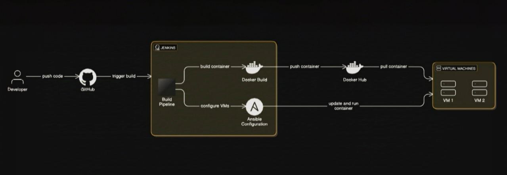

# Jenkins CI/CD Pipeline for Weather App

This repository includes a `Jenkinsfile` that defines a complete CI/CD pipeline for automating the build, test, and deployment process of the Weather App. The pipeline is designed to work with **Jenkins** and integrates Docker and Docker Hub for containerization and deployment.

## Pipeline Overview

The pipeline consists of the following stages:

1. **Checkout**: Clone the repository from GitHub.
2. **Build and Push Docker Image**: Build the Docker image for the application and push it to Docker Hub.
3. **Continuous Deployment (CD)**: Pull and run the Docker image from Docker Hub to deploy the application.

---
# Weather App 🌤️

This is a simple weather application built using **Flask**, **SQLite**, and the **OpenWeatherMap API**. The app allows users to search for the weather of a specific city, view past searches, and remove cities from the database.

## Features

- **City Search**: Search weather for any city using the OpenWeatherMap API.
- **Cached Weather Data**: Caches weather data in an SQLite database to minimize API calls.
- **Last Searched City**: Saves the last searched city and displays it when you return to the homepage.
- **City Management**: You can delete cities from the weather history.

 

## Project Structure

 


## Installation

To set up and run the app locally, follow these steps:

### Prerequisites

Make sure you have the following installed:

- Python 3.x
- Docker (optional for containerization)

### Clone the Repository

```bash
git clone https://github.com/yourusername/weather-app.git
cd weather-app
```
Install Dependencies
If you're running the app locally (not in a container), create a virtual environment and install dependencies.

```bash
python3 -m venv venv
source venv/bin/activate  # On Windows, use 'venv\Scripts\activate'
pip install -r requirements.txt
```
Set Up the Database
The application uses SQLite for storing weather data and the last searched city. The database will be automatically created when the app starts, but you can also initialize it manually by running:
# Running the App
Start the Flask app:
```bash
python3 app.py
```
# Docker Setup
If you prefer to run the app in a Docker container, follow these steps:
1 - Build the Docker Image:
```bash
docker build -t weather-app-container .
```
2 - Run the Docker Container:
```bash
docker run -d -p 5000:5000 --name weather-app-container my-weather-app
```
3 - Visit the app at
```localhost
http://localhost:5000
```
# Set Up Ansible
```bash
sudo apt update
sudo apt install ansible
chmod 600 ansible-test.pem

```
# Run the Ansible Playbook
```bash
ansible-playbook -i inventory.ini deploy_playbook.yml
```
### The application should be accessible via 
```bash
http://localhost:5000
```
# Requirements
 - Flask
 - requests
 - sqlite3
 ### These dependencies are listed in requirements.txt, which you can install using:
```bash
pip install -r requirements.txt
```


